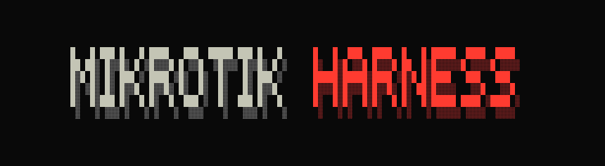

# MikroTik Harness

<p align="center">
  
</p>

<p align="center">
  Клавиатурный LLM-harness для диагностики и управления MikroTik RouterOS.
</p>

<p align="center">
  <a href="pyproject.toml"></a>
  <a href="LICENSE"></a>
  
  
  
  
  
</p>

[English README](README.md)

`mth` — клавиатурный LLM-harness для RouterOS. Он обнаруживает MikroTik по MNDP,
регистрирует выбранный роутер через MikroMCP и предоставляет агентский цикл для чтения
состояния и управляемого изменения подключённого устройства.

MikroMCP — типизированный backend RouterOS и источник живого MCP-каталога. Harness владеет
discovery, доверием к устройству, интеграцией моделей, режимами доступа, runbook-ами,
подтверждениями, историей и Textual UI. LLM не выбирает router ID и не получает больше прав,
чем разрешено текущим режимом.

## Требования и запуск

- Python 3.11+
- Node.js 22+
- RouterOS 7.x с HTTPS REST через `www-ssl`
- LM Studio, Ollama, `ai.local` или другой OpenAI-compatible endpoint

MikroMCP подключён как git submodule на `v1.10.0`. Harness использует официальный Python MCP
SDK через stdio и запускает Node.js backend дочерним процессом. Исходники submodule не изменяются;
игнорируемая compatibility-копия bundle лишь добавляет два RouterOS runtime-поля в фильтр
rollback snapshot и создаётся с fail-closed проверкой точки вставки.

```powershell
python -m venv .venv
git submodule update --init
npm --prefix external/mikromcp ci
npm --prefix external/mikromcp run build
.venv\Scripts\python -m pip install -e ".[dev]"
mth
```

Приватное состояние хранится в игнорируемом `.mth/`: регистрация MikroMCP, trust-записи,
зашифрованные secrets провайдеров, история runbook-ов и recovery-артефакты HIGH RISK.

## Discovery и регистрация

Discovery показывает MNDP-соседей: MAC, адреса, identity, RouterOS version и board. Адрес можно
ввести вручную. Регистрация проверяет HTTPS REST, сохраняет TLS fingerprint, записывает форматы
MikroMCP `routers.yaml`/environment, получает живой `tools/list` и проверяет
`check_router_health` вместе с `get_system_status`. Несовпадение сохранённого fingerprint —
жёсткая остановка.

RouterOS REST работает через `www-ssl`, а `api-ssl` — отдельный бинарный API. Для тестового
CHR:

```routeros
/certificate add name=mth-ca common-name=mth-ca key-usage=key-cert-sign,crl-sign
/certificate sign mth-ca
/certificate add name=mth-https common-name=192.168.56.103 subject-alt-name=IP:192.168.56.103 key-usage=tls-server
/certificate sign mth-https ca=mth-ca
/ip service set www-ssl port=443 certificate=mth-https disabled=no
```

## Режимы агента

`Tab` переключает `PLAN`, `READY` и `HIGH RISK`.

### PLAN

Только разведка. Harness получает живой каталог MikroMCP и передаёт модели только
router-bound read-only инструменты. Модель может читать состояние и объяснять его, но не может
создавать или выполнять изменения.

### READY

Основной режим управляемых изменений. Модель получает полный живой read-only каталог и
harness-owned proposal-инструменты:

- девять reviewed runbook-ов: PPPoE, bridge, IP address, address list, DHCP core, DNS, NAT,
  административные сервисы и WireGuard;
- typed proposal-ы для тех write-схем MikroMCP, которые поддержаны текущим reviewed workflow
  harness-а.

Прямые backend write-tools модели не передаются. Каждый proposal проходит:

```text
proposal → typed form → baseline → dry-run → human approval
→ MikroMCP confirmation → apply → post-check → journal/history
→ отдельно подтверждённый rollback
```

Секреты вводятся в masked form и подставляются только при сборке подтверждённого backend-вызова.
Они не попадают в plan, transcript, model context и history. После успешной проверки модель
формирует короткий отчёт пользователю на русском.

Каталог MikroMCP динамический и не считается фиксированным числом. Само наличие backend tool не
делает его поддержанным READY-сценарием: чувствительные, неоткатываемые или неполные схемы
остаются за границей поддержанного контракта до появления reviewed workflow.
Контракт строится из живого каталога и показывает покрытие read/write, отсутствующие зависимости
runbook-ов, явно исключённые операции, действительно неразобранные write-tools и случайное
попадание raw write-tools в READY. Полнота контракта означает, что каждая write-команда
классифицирована, а не то, что опасные и служебные команды открыты модели.

### HIGH RISK

HIGH RISK — явный режим расширенных полномочий. Он сохраняет инструменты READY и добавляет
живой каталог MikroMCP, прямые write-tools и `ssh_exec` для однострочных CLI-команд RouterOS.
Поштучного approval нет: повышенное доверие выражается самим входом в режим.

До открытия composer harness:

1. выполняет независимый SSH host-key TOFU и блокирует последующее несовпадение;
2. создаёт через MikroMCP зашифрованный binary backup и текстовый export;
3. скачивает их по SFTP через тот же pinned SSH transport, проверяет и сохраняет manifest в
   `.mth/high-risk-backups/<router-id>/`;
4. открывает постоянный AsyncSSH PTY, выполняет terminal negotiation и подтверждает prompt
   `<SAFE>`.

Каждая CLI-команда получает уникальный framing marker, ограничение времени и вывода и выполняется
в том же PTY, поэтому контекст меню и Safe Mode сохраняются между вызовами. Для совместимости с
RouterOS application keepalive AsyncSSH отключён; живость определяется TCP, framing и явным
состоянием сессии.

Выход требует явного выбора: commit и закрытие, abort с откатом Safe Mode или оставить сессию
открытой. `/quit` не отправляется до разрешения этого выбора. `/rollback` в HIGH RISK означает
только отдельно подтверждённое восстановление полного pre-flight `.backup`, после которого
роутер перезагрузится и связь кратко прервётся.

Системный prompt HIGH RISK требует семь шагов: понять запрос, изучить состояние, спланировать,
быстро проверить план, выполнить, проверить результат и отчитаться. Reasoning идёт на английском,
общение с пользователем — на русском. Если установлен проверенный переносимый пакет документации,
модель получает локальный read-only инструмент `search_routeros_docs`: короткий английский запрос
возвращает ограниченные по размеру фрагменты с URL и явной меткой недоверенных справочных данных.

## Переносимый RAG pack

`mth rag` скачивает официальный Markdown-корпус MikroTik только если папка pack-а пуста. Временные
сетевые сбои, HTTP 429 и серверные ошибки повторяются автоматически. Внутри
остаются исходные Markdown-файлы, manifest с SHA-256 и локальный индекс SQLite FTS5. Заполненная
папка сначала проверяется, затем открывается без единого сетевого запроса: её можно перенести на
объект с флешки.

```powershell
mth rag
mth rag --query "safe mode rollback"
mth rag --rag-dir E:\routeros-rag --query "bridge vlan filtering" --json
```

По умолчанию используется `.mth/rag`; путь меняется через `MTH_RAG_HOME` или `--rag-dir`. Проект
не распространяет корпус MikroTik: пользователь собирает локальную копию из официального источника
или переносит уже проверенную папку с соблюдением условий документации. Chroma и embedding-модель
не обязательны — первый вариант использует встроенный SQLite FTS5. Подробнее:
[rag-packs.md](docs/rag-packs.md).

## Модели и команды

`/model` сохраняет preset локальной модели или любого OpenAI-compatible endpoint.
Credentials хранятся отдельно в защищённом vault; `/models` выбирает или удаляет preset.
Поддерживаются русский/английский UI, ограниченная память диалога, warm-up модели,
потоковые OpenAI-compatible ответы с переключаемым блоком размышлений, нормализованные
reasoning/tool events, inline approval, история сессий и копирование transcript.

```text
/help       справка
/info       устройство и модель
/model      добавить или изменить preset
/models     выбрать или удалить preset
/language   русский или английский
/new        новый чат
/history    список сессий
/resume     последняя сессия
/log        локальный audit transcript
/clear      очистить transcript и память модели
/rollback   preview и подтверждение rollback
/exit       выйти из чата
```

Headless discovery:

```powershell
mth discover
mth discover --json
mth discover --broadcast 192.168.56.255
```

## Проверки

```powershell
pytest
ruff check .
mypy src
python -m mth --help
```

Ограничения backend описаны в [docs/backend-capability-gaps.md](docs/backend-capability-gaps.md),
архитектура Block B — в [docs/block-b-architecture.md](docs/block-b-architecture.md), а
live-промпты для проверки моделей — в
[docs/model-evaluation-prompts-ru.md](docs/model-evaluation-prompts-ru.md).

## Лицензия

MikroTik Harness распространяется по [лицензии MIT](LICENSE).
